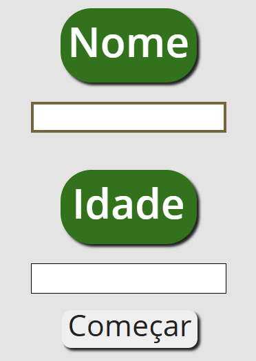
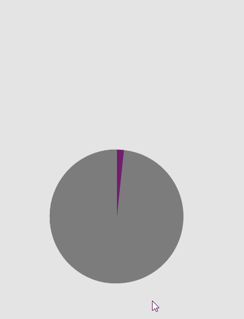
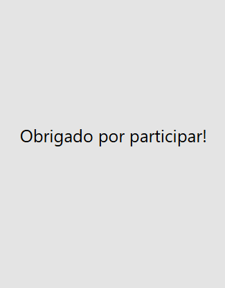

# Research Survey
## Languages
This first section is in English. 

[Versão em português logo abaixo.](#Questionario-de-Pesquisa)

## Context
Survey (in Brazilian Portuguese: "Questionário") created to be applied in a research project of the research group "GPSABilíngue". 

The research that originated this digital survey is a branch of the research of a "Narrative text evaluation instrument in Brazilian sign language" entitled "Nar-VaL-Libras/Comp.".

This research instrument is the result of research developed by the linguist from the University of Barcelona/Spain, Dr. Maria Josep Jarque and her collaborators from the Tres Pins school and the Educational Resources Center for the Hearing Impaired (CREDA) Pere Barnils in Catalonia/Spain, in partnership with the researcher from the Federal University of São Carlos/Brazil, Dr. Cristina Broglia Feitosa de Lacerda.

More information about the use of this digital survey can be read here (in Portuguese): [Academic paper comparing results using non-digital survey and digital survey](https://publicacao.copels.com.br/index.php/linguistica/article/view/189).

## Purpose of this survey
This survey is applied in conjunction with other research instruments, such as videos in Brazilian Sign Language (Libras), which contain graphic elements similar to those used in this survey.

The research with this sigital survey consists of four stages:
1. The research participant enters his/her information;

<p align="center">
  
</p>

2. Three test questions are presented to ensure that the research participant understands how the research will be carried out, with the question asked in the video shown and having three alternatives - these questions have different graphic elements from the official questions;

<p align="center">
  
</p>

3. Fifteen survey questions, in which the participant answers as previously discussed;

<p align="center">
  
</p>

4. Download the research participant's responses to the device in the file ```Avaliacao_Compreensao_Libras.csv``` for later analysis by the research team members.

<p align="center">
  
</p>

## How to use this survey
To access this questionnaire, access its web version at https://xuaun.github.io/questionario/.

## Technologies used
In this project, ```HTML```, ```CSS```, ```JavaScript (with React and surveyjs: Survey Library JavaScript``` were used.

____
<br>

# Questionário de Pesquisa
## Contexto
Questionário criado para ser aplicado no projeto de pesquisa do grupo "GPSABilíngue".

A pesquisa que originou este questionário virtual faz parte da pesquisa sobre um "Instrumento de avaliação de texto narrativo em língua de sinais (Libras)" entitulado "Nar-VaL-Libras/Comp.".

Este instrumento de pesquisa é resultado de uma pesquisa desenvolvida pela linguista da Universidade de Barcelona/Epanha, Dr.ª Maria Josep Jarque e seus colaboradores da escola Tres Pins e do Centro de Recursos Educacionais para Deficientes Auditivos (CREDA) Pere Barnils na Catalunha/Espanha, em parceria com a pesquisadora da Universidade Federal de São Carlos/Brasil, Dr.ª Cristina Broglia Feitosa de Lacerda.

Mais informação sobre o uso deste questionário virtual pode ser visto aqui: [Publicação dos dados de pesquisa comparando aplicação em papel e digital](https://publicacao.copels.com.br/index.php/linguistica/article/view/189).

## Proposta deste questionário
Este questionário é aplicado em conjunto com outros instrumentos de pesquisa, como vídeos em Libras, que contém elementos gráficos semelhantes aos utilizados neste questionário.

A pesquisa com este questionário consta de quatro etapas:
1. O participante de pesquisa insere suas informações;

<p align="center">
  
</p>

2. Três perguntas testes são apresentadas para garantir que o participante da pesquisa entendeu como a pesquisa será realizada, sendo a pergunta feita no vídeo apresentado e contando com três alternativas - estas perguntas possuem elementos gráficos distintos das perguntas oficiais;

<p align="center">
  
</p>

3. Quinze perguntas da pesquisa, em que o participante responde como discorrido anteriormente;

<p align="center">
  
</p>

4. Download no dispositivo das respostas do participante de pesquisa em arquivo ```Avaliacao_Compreensao_Libras.csv``` para posterior análise dos membros da equipe de pesquisa.

<p align="center">
  
</p>

## Instruções de uso
Para acessar este questionário, acesse sua versão web em https://xuaun.github.io/questionario/.

## Tecnologias utilizadas
Neste projeto, foi utilizado ```HTML```, ```CSS```, ```JavaScript (com React e surveyjs: Survey Library JavaScript``` .
